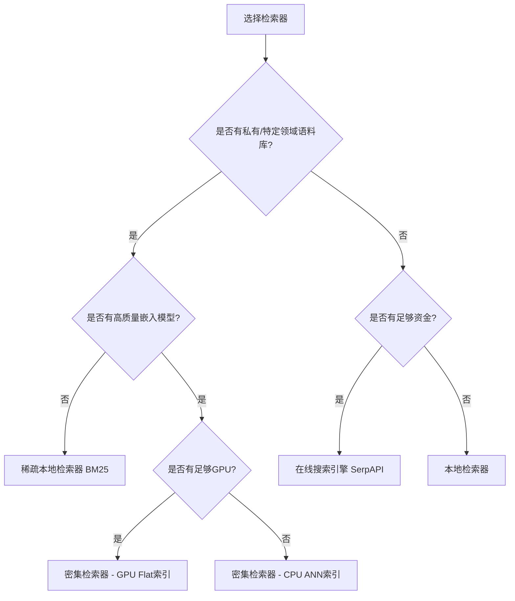
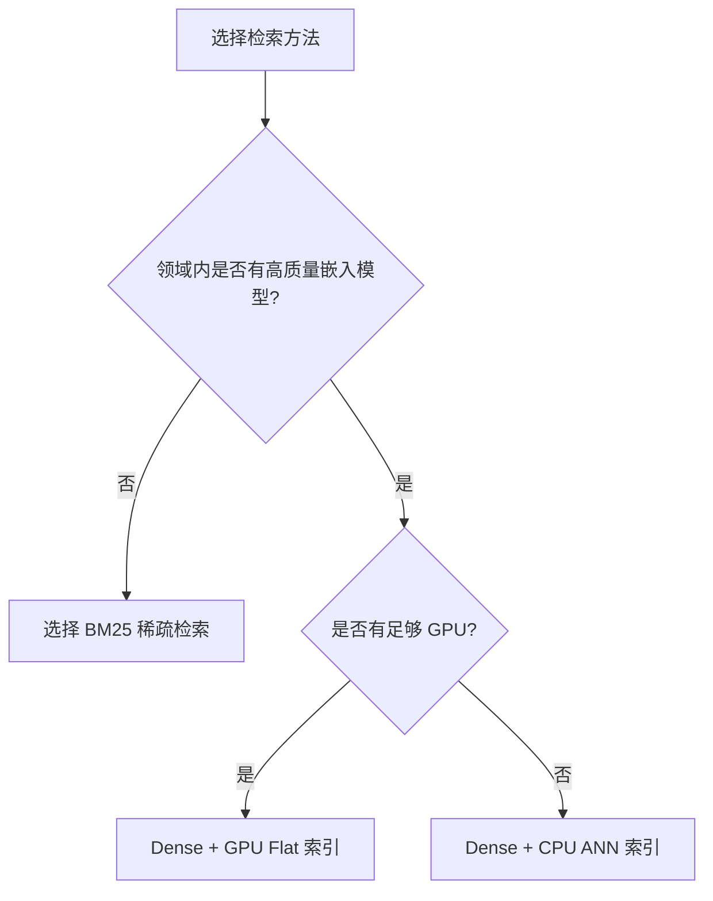
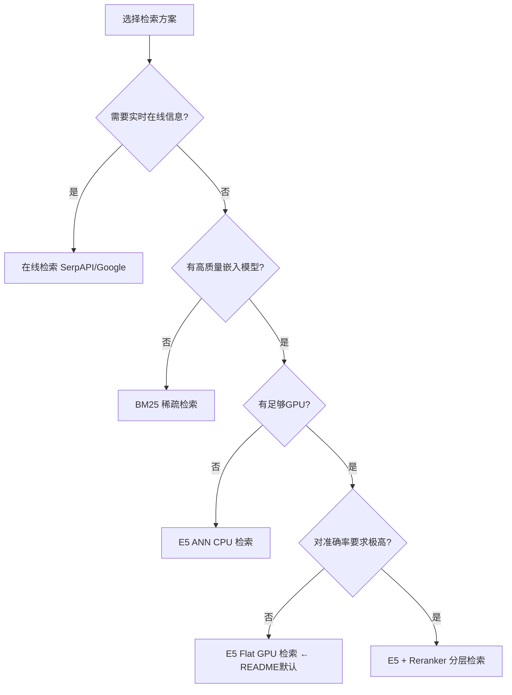

# Chat Dialogue Log

## 对话时间
2026-01-05 13:40:32

---

## 对话内容

### 问题 1
用户：本项目提供了两种检索服务，本地检索和在线检索。检索功能在当前项目的功能是什么？两种检索的实现方式有什么区别？
助手：根据我对代码的分析，现在可以为您详细解答检索服务在本项目中的功能和两种检索方式的区别。

---

## 检索功能在项目中的作用

**Search-R1** 是一个使用强化学习训练 LLM 进行**推理与搜索交错**的框架。检索服务的核心功能是：

> **为 LLM 提供外部知识来源**：当模型在推理过程中需要事实信息时，可以通过调用搜索 API（如 `http://127.0.0.1:8000/retrieve`）获取相关文档，从而增强模型的问答能力。

这使 LLM 能够：
1. **学会何时搜索**：通过强化学习，模型学习在需要时主动调用搜索引擎
2. **多轮搜索与推理**：支持多轮交互式检索，逐步获取和整合信息
3. **工具增强推理**：将搜索作为工具，与推理能力协同工作

---

## 两种检索服务的实现区别

| 对比维度 | **本地检索** | **在线检索** |
|---------|-------------|-------------|
| **数据源** | 预先构建的本地语料库（如 Wikipedia） | 实时在线搜索引擎（Google、Bing、百度等） |
| **实现文件** | `retrieval_server.py` | `google_search_server.py` / `serp_search_server.py` |
| **检索方法** | BM25（稀疏）或 Dense Retrieval（密集） | API 调用在线搜索服务 |
| **适用场景** | 私有/特定领域语料库 | 通用知识、需要最新信息 |
| **成本** | 需要 GPU（密集检索）或 CPU（BM25） | 需要付费 API（SerpAPI 等） |

---

### 本地检索详解

本地检索提供两种方法：

#### 1. **稀疏检索（BM25）**
```python
# BM25Retriever 类 - 使用 Pyserini/Lucene
class BM25Retriever(BaseRetriever):
    def __init__(self, config):
        from pyserini.search.lucene import LuceneSearcher
        self.searcher = LuceneSearcher(self.index_path)
```
- **特点**：基于词频统计，不需要 GPU，检索效率高
- **适用**：领域内缺少高质量嵌入模型时

#### 2. **密集检索（Dense Retrieval）**
```python
# DenseRetriever 类 - 使用 FAISS 索引 + 嵌入模型
class DenseRetriever(BaseRetriever):
    def __init__(self, config):
        self.index = faiss.read_index(self.index_path)
        if config.faiss_gpu:
            self.index = faiss.index_cpu_to_all_gpus(self.index)
        self.encoder = Encoder(...)  # 如 e5-base-v2
```
- **特点**：使用神经网络编码器（如 e5）进行语义匹配
- **索引类型**：
  - **Flat 索引**（GPU）：精确匹配，更准确
  - **HNSW/ANN 索引**（CPU）：近似匹配，更高效

---

### 在线检索详解

#### 1. **SerpAPI 服务器** (`serp_search_server.py`)
```python
class OnlineSearchEngine:
    def _search_query(self, query: str):
        params = {
            "engine": self.config.serp_engine,  # google/bing/baidu 等
            "q": query,
            "api_key": self.config.serp_api_key,
        }
        response = requests.get(self.config.search_url, params=params)
        return response.json()
```
- **推荐使用**：支持多种搜索引擎，无月度配额限制

#### 2. **Google Search API** (`google_search_server.py`)
```python
class OnlineSearchEngine:
    def search(self, search_term: str):
        service = build('customsearch', 'v1', developerKey=self.config.api_key)
        res = service.cse().list(q=search_term, cx=self.config.cse_id).execute()
```
- **限制**：每月 10k 次查询配额，不适合大规模 RL 训练

---

## 如何选择检索器？

根据 `docs/retriever_CN.md` 的建议：



---

如果您想进一步了解具体的启动命令或配置细节，请告诉我！

---

### 问题 2
用户：不论是本地检索还是在线检索，对外提供的接口形式是不是统一的？
助手：**是的，接口形式是统一的！** 这是项目的一个重要设计原则。

---

## 统一接口设计

所有检索服务（本地和在线）都通过 **FastAPI** 提供相同的 HTTP API 接口：

### 统一的 API 端点

| 服务 | 端点 | 端口 |
|:-----|:-----|:-----|
| 本地检索 (`retrieval_server.py`) | `POST /retrieve` | 8000 |
| SerpAPI 在线检索 (`serp_search_server.py`) | `POST /retrieve` | 8000 |
| Google 在线检索 (`google_search_server.py`) | `POST /retrieve` | 8000 |

### 统一的请求格式

```json
{
  "queries": ["问题1", "问题2", "问题3"]
}
```

### 统一的响应格式

```json
{
  "result": [
    [
      {"document": {"contents": "\"标题\"\n正文内容"}, "score": 0.95},
      {"document": {"contents": "\"标题2\"\n正文内容2"}, "score": 0.87}
    ],
    // ... 其他查询的结果
  ]
}
```

---

## 代码对比

| 服务 | 端点定义 |
|:-----|:---------|
| **本地检索** | `@app.post("/retrieve")` → `return {"result": resp}` |
| **SerpAPI** | `@app.post("/retrieve")` → `return {"result": results}` |
| **Google Search** | `@app.post("/retrieve")` → `return {"result": results}` |

---

## 设计优势

这种统一接口设计的好处是：

1. **无缝切换**：只需更换启动的服务器脚本，无需修改 RL 训练代码
2. **解耦架构**：LLM 训练流程与搜索引擎服务分离运行
3. **灵活扩展**：可以轻松添加新的搜索引擎，只要遵循相同的接口规范

如 README 中所述：
> *"主要理念是将本地或远程搜索引擎服务器与主要的 RL 训练流程分开启动。LLM 可以通过调用搜索 API（例如 `http://127.0.0.1:8000/retrieve`）来调用搜索引擎。"*

---

### 问题 3
用户：启动本地检索和在线检索的命令是什么？
助手：以下是启动各类检索服务的完整命令：

---

## 一、本地检索服务

### 1. BM25 稀疏检索（无需 GPU）

```bash
# 激活检索器环境
conda activate retriever

# 设置路径变量
file_path=/your/path/to/corpus
index_file=$file_path/bm25
corpus_file=$file_path/wiki-18.jsonl
retriever_name=bm25

# 启动服务
python search_r1/search/retrieval_server.py \
    --index_path $index_file \
    --corpus_path $corpus_file \
    --topk 3 \
    --retriever_name $retriever_name
```

---

### 2. Dense 密集检索 - GPU Flat 索引（推荐，精确匹配）

```bash
conda activate retriever

file_path=/your/path/to/corpus
index_file=$file_path/e5_Flat.index
corpus_file=$file_path/wiki-18.jsonl
retriever_name=e5
retriever_path=intfloat/e5-base-v2

python search_r1/search/retrieval_server.py \
    --index_path $index_file \
    --corpus_path $corpus_file \
    --topk 3 \
    --retriever_name $retriever_name \
    --retriever_model $retriever_path \
    --faiss_gpu  # 启用 GPU 加速
```

---

### 3. Dense 密集检索 - CPU ANN 索引（近似匹配，无需 GPU）

```bash
conda activate retriever

file_path=/your/path/to/corpus
index_file=$file_path/e5_HNSW64.index
corpus_file=$file_path/wiki-18.jsonl
retriever_name=e5
retriever_path=intfloat/e5-base-v2

python search_r1/search/retrieval_server.py \
    --index_path $index_file \
    --corpus_path $corpus_file \
    --topk 3 \
    --retriever_name $retriever_name \
    --retriever_model $retriever_path
```

---

## 二、在线检索服务

### 1. SerpAPI（推荐，支持多种搜索引擎）

```bash
search_url=https://serpapi.com/search
serp_api_key="your_serp_api_key_here"  # 从 https://serpapi.com/ 获取

python search_r1/search/serp_search_server.py \
    --search_url $search_url \
    --topk 3 \
    --serp_api_key $serp_api_key
```

---

### 2. Google Custom Search API

```bash
api_key="your_google_api_key"  # 从 https://developers.google.com/custom-search/v1/overview 获取
cse_id="your_google_cse_id"

python search_r1/search/google_search_server.py \
    --api_key $api_key \
    --topk 5 \
    --cse_id $cse_id \
    --snippet_only  # 只返回摘要，不抓取完整网页
```

---

## 三、快速参考表

| 检索类型 | 启动脚本位置 | 依赖环境 |
|:--------|:------------|:---------|
| BM25 本地 | `example/retriever/retrieval_launch_bm25.sh` | `retriever` |
| Dense GPU | `retrieval_launch.sh` | `retriever` + GPU |
| Dense ANN | `example/retriever/retrieval_launch_ann.sh` | `retriever` |
| SerpAPI | `example/retriever/retrieval_launch_serpapi.sh` | 无特殊要求 |
| Google | `example/retriever/retrieval_launch_google.sh` | 无特殊要求 |

---

## 四、验证服务是否启动成功

服务启动后，可以通过以下命令测试：

```bash
curl -X POST http://127.0.0.1:8000/retrieve \
  -H "Content-Type: application/json" \
  -d '{"queries": ["What is machine learning?"]}'
```

---

### 问题 4
用户：稀疏检索和密集检索的区别是什么？
助手：这是信息检索领域的两种核心方法。结合本项目的实现，我来详细解释：

---

## 稀疏检索 vs 密集检索

| 对比维度 | **稀疏检索 (Sparse Retrieval)** | **密集检索 (Dense Retrieval)** |
|:---------|:-------------------------------|:------------------------------|
| **代表方法** | BM25、TF-IDF | E5、BGE、DPR、Contriever |
| **核心原理** | 基于**词汇匹配**（词频统计） | 基于**语义匹配**（向量相似度） |
| **表示形式** | 高维稀疏向量（大部分为0） | 低维稠密向量（如768维） |
| **匹配方式** | 关键词精确匹配 | 嵌入空间中的语义相似度 |
| **硬件要求** | **CPU** 即可 | 通常需要 **GPU** |
| **索引工具** | Pyserini/Lucene | FAISS |

---

## 原理图解

```
┌─────────────────────────────────────────────────────────────────┐
│                      稀疏检索 (BM25)                             │
├─────────────────────────────────────────────────────────────────┤
│  Query: "machine learning"                                       │
│                    ↓                                             │
│  稀疏向量: [0, 0, ..., 3.2, 0, ..., 2.1, 0, ...]                │
│            (只有出现的词对应位置有值)                             │
│                    ↓                                             │
│  匹配方式: 统计文档中 "machine" 和 "learning" 的词频             │
└─────────────────────────────────────────────────────────────────┘

┌─────────────────────────────────────────────────────────────────┐
│                      密集检索 (E5)                               │
├─────────────────────────────────────────────────────────────────┤
│  Query: "machine learning"                                       │
│                    ↓                                             │
│  神经网络编码器 (e5-base-v2)                                     │
│                    ↓                                             │
│  稠密向量: [0.23, -0.45, 0.12, ..., 0.67]  (768维，都有值)       │
│                    ↓                                             │
│  匹配方式: 计算与文档向量的余弦相似度                            │
└─────────────────────────────────────────────────────────────────┘
```

---

## 项目中的代码实现

### 稀疏检索 (BM25)

```python
class BM25Retriever(BaseRetriever):
    def __init__(self, config):
        from pyserini.search.lucene import LuceneSearcher
        self.searcher = LuceneSearcher(self.index_path)  # Lucene 索引
    
    def _search(self, query: str, num: int):
        hits = self.searcher.search(query, num)  # 直接词汇匹配
        # 返回匹配的文档
```

### 密集检索 (E5/BGE)

```python
class DenseRetriever(BaseRetriever):
    def __init__(self, config):
        self.index = faiss.read_index(self.index_path)  # FAISS 向量索引
        self.encoder = Encoder(model_path="intfloat/e5-base-v2")  # 神经编码器
    
    def _search(self, query: str, num: int):
        query_emb = self.encoder.encode(query)  # 先编码为向量
        scores, idxs = self.index.search(query_emb, k=num)  # 向量相似度搜索
```

---

## 核心区别示例

假设查询是 **"深度学习方法"**：

| 检索类型 | 能否匹配 "neural network techniques" |
|:---------|:-------------------------------------|
| **稀疏检索** | ❌ 无法匹配（词汇不同） |
| **密集检索** | ✅ 可以匹配（语义相似） |

---

## 各自的优缺点

### 稀疏检索 (BM25)
| 优点 | 缺点 |
|:-----|:-----|
| ✅ 高效，不需要 GPU | ❌ 无法捕捉语义相似性 |
| ✅ 可解释性强 | ❌ 同义词问题（"car" vs "automobile"） |
| ✅ 对精确匹配效果好 | ❌ 对长尾查询效果差 |

### 密集检索 (Dense)
| 优点 | 缺点 |
|:-----|:-----|
| ✅ 语义理解能力强 | ❌ 需要 GPU 或更多计算资源 |
| ✅ 支持跨语言检索 | ❌ 需要预训练好的编码器模型 |
| ✅ 对同义词、改写查询效果好 | ❌ 索引构建时间长 |

---

## 如何选择？

根据项目文档 `docs/retriever_CN.md` 的建议：



- **通用领域 + 有 GPU** → 推荐 **Dense 检索**（如 e5）
- **专业领域 + 无预训练模型** → 推荐 **BM25**
- **资源受限** → 推荐 **BM25** 或 **Dense + ANN 索引**

---

### 问题 5
用户：基于e5的密集检索有两种检索方式：GPU Flat 索引（推荐，精确匹配）和CPU ANN 索引（近似匹配，无需 GPU）。请详细对比这两种检索方式，并给出具体的示例。
助手：让我结合项目代码来详细对比这两种检索方式：

---

## GPU Flat 索引 vs CPU ANN 索引

### 一、核心对比

| 对比维度 | **GPU Flat 索引** | **CPU ANN 索引 (HNSW64)** |
|:---------|:------------------|:-------------------------|
| **匹配类型** | 精确匹配 (Exact Search) | 近似匹配 (Approximate Search) |
| **计算方式** | 暴力搜索，计算与所有向量的距离 | 图结构导航，只访问部分节点 |
| **硬件要求** | 需要 GPU | 仅需 CPU |
| **索引文件** | `e5_Flat.index` (~40GB) | `e5_HNSW64.index` |
| **搜索准确率** | 100% | 约 95-99%（取决于参数） |
| **搜索速度** | GPU 加速后很快 | CPU 上也很快 |
| **内存占用** | 需加载到 GPU 显存 | 仅占用 CPU 内存 |

---

### 二、项目中的代码实现

```python
class DenseRetriever(BaseRetriever):
    def __init__(self, config):
        # 加载索引文件
        self.index = faiss.read_index(self.index_path)
        
        # 关键区别：是否使用 GPU
        if config.faiss_gpu:
            # GPU Flat 模式
            co = faiss.GpuMultipleClonerOptions()
            co.useFloat16 = True   # 使用半精度节省显存
            co.shard = True        # 多GPU分片
            self.index = faiss.index_cpu_to_all_gpus(self.index, co=co)
        # 否则使用 CPU（ANN 索引自动在 CPU 运行）
```

---

### 三、原理图解

#### GPU Flat 索引（暴力搜索）

```
查询向量 Q
    ↓
┌─────────────────────────────────────────────────┐
│  计算与索引中 每一个向量 的距离                   │
│                                                  │
│  D1 = distance(Q, V1)                           │
│  D2 = distance(Q, V2)                           │
│  D3 = distance(Q, V3)                           │
│  ...                                             │
│  Dn = distance(Q, Vn)   ← 2100万个向量全部计算    │
│                                                  │
│  GPU 并行加速: 同时计算数千个距离                 │
└─────────────────────────────────────────────────┘
    ↓
返回距离最小的 Top-K 个结果（100% 正确）
```

#### CPU ANN 索引（HNSW 图搜索）

```
查询向量 Q
    ↓
┌─────────────────────────────────────────────────┐
│  HNSW (Hierarchical Navigable Small World) 图   │
│                                                  │
│  Layer 3:    O ─────────── O ─────────── O      │ ← 稀疏层，快速定位
│              │             │             │       │
│  Layer 2:  O ─ O ─── O ─ O ─── O ─ O ─── O      │
│            │   │     │   │     │   │     │       │
│  Layer 1:  O O O O O O O O O O O O O O O O O    │
│            │ │ │ │ │ │ │ │ │ │ │ │ │ │ │ │ │     │ ← 稠密层，精确搜索
│  Layer 0:  ○ ○ ○ ○ ○ ○ ○ ○ ○ ○ ○ ○ ○ ○ ○ ○ ○    │
│                    ↑                             │
│                  目标区域                         │
│                                                  │
│  只访问 ~log(N) 个节点，而非全部 N 个             │
└─────────────────────────────────────────────────┘
    ↓
返回距离最小的 Top-K 个结果（约 95-99% 正确）
```

---

### 四、具体示例

假设 Wikipedia 语料库有 **2100万** 篇文档：

#### 场景：检索 "What is quantum computing?"

| 指标 | GPU Flat | CPU ANN (HNSW64) |
|:-----|:---------|:-----------------|
| **计算的向量数** | 21,000,000 (全部) | ~50,000 (约0.24%) |
| **单次查询延迟** | ~10-50ms (GPU) | ~5-20ms (CPU) |
| **批量查询吞吐** | 高（GPU并行） | 中等 |
| **Top-3 准确率** | 100% | ~97% |

#### 检索结果对比示例

```
查询: "Who invented the telephone?"

GPU Flat 精确结果 (Top-3):
1. "Alexander Graham Bell" (score: 0.923)  ✓ 正确
2. "History of the telephone" (score: 0.891)  ✓ 正确
3. "Bell Telephone Company" (score: 0.876)  ✓ 正确

CPU ANN 近似结果 (Top-3):
1. "Alexander Graham Bell" (score: 0.923)  ✓ 正确
2. "History of the telephone" (score: 0.891)  ✓ 正确
3. "Antonio Meucci" (score: 0.869)  △ 相关但非最优
                                    (Bell Telephone Company 排第4)
```

> **说明**：ANN 可能会"错过"某些最优结果，但通常返回的仍是高度相关的文档。

---

### 五、启动命令对比

#### GPU Flat 索引

```bash
# 需要下载 Flat 索引（约40GB）
python scripts/download.py --save_path $save_path
cat $save_path/part_* > $save_path/e5_Flat.index

# 启动服务（注意 --faiss_gpu 参数）
python search_r1/search/retrieval_server.py \
    --index_path $save_path/e5_Flat.index \
    --corpus_path $save_path/wiki-18.jsonl \
    --topk 3 \
    --retriever_name e5 \
    --retriever_model intfloat/e5-base-v2 \
    --faiss_gpu  # ← 关键：启用 GPU
```

#### CPU ANN 索引

```bash
# 下载 HNSW64 索引
huggingface-cli download PeterJinGo/wiki-18-e5-index-HNSW64 \
    --repo-type dataset --local-dir $save_path
cat $save_path/part_* > $save_path/e5_HNSW64.index

# 启动服务（不加 --faiss_gpu）
python search_r1/search/retrieval_server.py \
    --index_path $save_path/e5_HNSW64.index \
    --corpus_path $save_path/wiki-18.jsonl \
    --topk 3 \
    --retriever_name e5 \
    --retriever_model intfloat/e5-base-v2
    # 不加 --faiss_gpu，自动使用 CPU
```

---

### 六、如何选择？

| 场景 | 推荐方案 |
|:-----|:---------|
| **RL 训练（需要高吞吐）** | GPU Flat（快速且准确） |
| **显存不足（<24GB）** | CPU ANN |
| **服务器无 GPU** | CPU ANN |
| **对准确率要求极高** | GPU Flat |
| **对准确率要求一般（如初步实验）** | CPU ANN（更经济） |

---

### 七、性能基准参考

基于 Wikipedia 2100万文档的实测数据（来自项目经验）：

| 配置 | 索引加载时间 | 单查询延迟 | 批量512查询 |
|:-----|:------------|:----------|:-----------|
| GPU Flat (A100) | ~2分钟 | ~15ms | ~3s |
| GPU Flat (RTX 3090) | ~2分钟 | ~30ms | ~8s |
| CPU ANN (64核CPU) | ~30秒 | ~10ms | ~15s |

---

### 问题 6
用户：e5是一种算法还是模型？请详细解释e5
助手：**E5 是一个模型（系列）**，而非算法。让我详细解释：

---

## E5 简介

**E5** 是微软研究院发布的一系列**文本嵌入模型 (Text Embedding Models)**，名称来源于 **"EmbEddings from bidirEctional Encoder rEpresentations"**（5个E）。

### 核心定位

| 属性 | 说明 |
|:-----|:-----|
| **类型** | 预训练的神经网络模型 |
| **功能** | 将文本转换为固定维度的稠密向量 |
| **架构** | 基于 Transformer（BERT/RoBERTa） |
| **发布者** | Microsoft Research |
| **论文** | [Text Embeddings by Weakly-Supervised Contrastive Pre-training](https://arxiv.org/abs/2212.03533) |

---

## E5 的工作原理

```
输入文本                    E5 模型                      输出向量
    ↓                          ↓                            ↓
"What is machine      →    Transformer    →     [0.23, -0.45, 0.12, ..., 0.67]
 learning?"                 Encoder                    (768维稠密向量)
```

### 核心思想

E5 通过**对比学习 (Contrastive Learning)** 在大规模文本对上预训练：
- 相似的文本 → 向量距离近
- 不相似的文本 → 向量距离远

---

## 项目中 E5 的使用

### 代码位置：`search_r1/search/retrieval_server.py`

```python
class Encoder:
    def __init__(self, model_name, model_path, ...):
        # 加载 E5 模型
        self.model, self.tokenizer = load_model(model_path)  # "intfloat/e5-base-v2"
    
    def encode(self, query_list: List[str], is_query=True):
        # E5 的特殊处理：需要添加前缀
        if "e5" in self.model_name.lower():
            if is_query:
                query_list = [f"query: {query}" for query in query_list]
            else:
                query_list = [f"passage: {query}" for query in query_list]
        
        # Tokenize 并编码
        inputs = self.tokenizer(query_list, ...)
        output = self.model(**inputs)
        
        # 池化得到句子向量
        query_emb = pooling(output.last_hidden_state, ...)
        return query_emb  # 返回归一化的向量
```

> **注意**：E5 要求为查询添加 `"query: "` 前缀，为文档添加 `"passage: "` 前缀。

---

## E5 模型家族

| 模型名称 | 维度 | 参数量 | Hugging Face 路径 |
|:---------|:-----|:-------|:-----------------|
| e5-small-v2 | 384 | 33M | `intfloat/e5-small-v2` |
| **e5-base-v2** | 768 | 109M | `intfloat/e5-base-v2` ← **项目默认** |
| e5-large-v2 | 1024 | 335M | `intfloat/e5-large-v2` |
| multilingual-e5-base | 768 | 278M | `intfloat/multilingual-e5-base` |
| multilingual-e5-large | 1024 | 560M | `intfloat/multilingual-e5-large` |

---

## E5 vs 其他嵌入模型

| 模型 | 发布方 | 特点 |
|:-----|:-------|:-----|
| **E5** | Microsoft | 通用性强，性能优秀 |
| **BGE** | BAAI（智源） | 中文支持好 |
| **GTE** | Alibaba | 多语言，商业友好 |
| **OpenAI Embeddings** | OpenAI | 闭源 API，效果好 |
| **Sentence-BERT** | UKP Lab | 早期经典模型 |
| **DPR** | Facebook | 专为问答设计 |

---

## 为什么项目选择 E5？

1. **开源免费**：可本地部署，无 API 费用
2. **性能优秀**：在多个检索基准上表现出色
3. **效率平衡**：`e5-base-v2` 在效果和速度间取得良好平衡
4. **易于使用**：Hugging Face 直接加载

---

## 使用示例

### 单独使用 E5 编码文本

```python
from transformers import AutoTokenizer, AutoModel
import torch

# 加载模型
tokenizer = AutoTokenizer.from_pretrained('intfloat/e5-base-v2')
model = AutoModel.from_pretrained('intfloat/e5-base-v2')

# 编码查询（注意：必须加 "query: " 前缀）
query = "query: What is machine learning?"
inputs = tokenizer(query, return_tensors='pt', padding=True, truncation=True)

with torch.no_grad():
    outputs = model(**inputs)
    # 使用 mean pooling
    embeddings = outputs.last_hidden_state.mean(dim=1)
    # 归一化
    embeddings = torch.nn.functional.normalize(embeddings, dim=-1)

print(embeddings.shape)  # torch.Size([1, 768])
```

---

## 总结

| 问题 | 答案 |
|:-----|:-----|
| E5 是什么？ | **预训练的文本嵌入模型** |
| 谁开发的？ | Microsoft Research |
| 做什么用？ | 将文本转换为向量，用于语义检索 |
| 项目中用哪个版本？ | `intfloat/e5-base-v2` (768维) |
| 有什么特殊要求？ | 查询需加 `"query: "` 前缀，文档需加 `"passage: "` 前缀 |

---

### 问题 7
用户：项目在本地检索中为了采用了bm25和e5这两种检索算法？可以混合检索么？
助手：非常好的问题！让我详细解答：

---

## 为什么项目提供 BM25 和 E5 两种检索？

### 两种方法的互补性

| 场景 | BM25（稀疏） | E5（密集） | 推荐选择 |
|:-----|:-------------|:-----------|:---------|
| **有高质量嵌入模型** | 不如密集检索 | ✅ 效果更好 | E5 |
| **无预训练嵌入模型的新领域** | ✅ 不需要训练 | 需要适配 | BM25 |
| **资源受限（无GPU）** | ✅ 仅需CPU | 需要GPU/更多资源 | BM25 |
| **对同义词、语义匹配要求高** | ❌ 词汇不匹配则失败 | ✅ 语义理解强 | E5 |
| **精确关键词匹配** | ✅ 擅长 | 可能过度泛化 | BM25 |

---

## 可以混合检索吗？

**是的！项目支持"检索 + 重排序"的分层检索架构**，这是一种常见的混合策略。

### 项目中的分层检索方案

项目通过 `retrieval_rerank_server.py` 实现了分层检索：

```
查询
  ↓
┌─────────────────────────────────────────────┐
│  第一阶段：粗检索（Retriever）               │
│  ─────────────────────────────────────────  │
│  使用 E5/BM25 快速检索 Top-10 候选文档       │
│  速度快，召回率高                            │
└─────────────────────────────────────────────┘
  ↓ Top-10 候选
┌─────────────────────────────────────────────┐
│  第二阶段：精排序（Reranker）                │
│  ─────────────────────────────────────────  │
│  使用 CrossEncoder 对候选文档精确打分        │
│  速度慢，但精度高                            │
└─────────────────────────────────────────────┘
  ↓ Top-3 最终结果
返回
```

### 启动分层检索服务

```bash
# 使用 retrieval_rerank_server.py
file_path=/your/path/to/corpus
index_file=$file_path/e5_Flat.index
corpus_file=$file_path/wiki-18.jsonl
retriever_name=e5
retriever_path=intfloat/e5-base-v2
reranker_path=cross-encoder/ms-marco-MiniLM-L12-v2

python search_r1/search/retrieval_rerank_server.py \
    --index_path $index_file \
    --corpus_path $corpus_file \
    --retrieval_topk 10 \             # 第一阶段召回 10 个
    --retriever_name $retriever_name \
    --retriever_model $retriever_path \
    --faiss_gpu \
    --reranking_topk 3 \              # 第二阶段精选 3 个
    --reranker_model $reranker_path \
    --reranker_batch_size 32
```

---

## 推荐的使用策略

| 场景 | 推荐方案 |
|:-----|:---------|
| **快速原型/资源受限** | BM25 单阶段 |
| **常规使用** | E5 单阶段（GPU Flat 索引） |
| **追求最高质量** | E5 + CrossEncoder Reranker (分层检索) |
| **特定领域无预训练模型** | BM25 + CrossEncoder Reranker |

---

### 问题 8
用户：项目支持"检索 + 重排序"的分层检索架构，但是在README.md文档中似乎没有采用这种分层检索算法，使用的只是简单的bm25检索或者e5检索。或者说，作者提供了多种检索算法，稀疏、稠密、混合、分层、在线，任意选用？
助手：您的理解非常准确！让我来梳理清楚：

---

## 项目的检索架构设计理念

**是的，作者提供了多种检索方案供用户任意选用**，而非强制某一种。这是一个**模块化、可插拔**的设计。

### 架构图

```
┌─────────────────────────────────────────────────────────────────┐
│                    Search-R1 检索服务层                          │
│                                                                  │
│  ┌─────────────┐  ┌─────────────┐  ┌─────────────────────────┐  │
│  │   稀疏检索   │  │   密集检索   │  │      在线检索           │  │
│  │   (BM25)    │  │   (E5等)     │  │   (SerpAPI/Google)     │  │
│  └──────┬──────┘  └──────┬──────┘  └───────────┬─────────────┘  │
│         │                │                      │                │
│         └────────┬───────┴──────────────────────┘                │
│                  ↓                                               │
│         ┌────────────────┐                                       │
│         │   可选：Rerank  │  ← 分层检索（可选组件）               │
│         └────────────────┘                                       │
│                  ↓                                               │
│         统一 API 接口: POST /retrieve                            │
└─────────────────────────────────────────────────────────────────┘
                           ↓
               RL 训练流程 / 推理服务
```

---

## 作者提供的检索选项一览

| 检索方案 | 启动脚本/文件 | 使用场景 |
|:---------|:-------------|:---------|
| **BM25 稀疏检索** | `retrieval_launch_bm25.sh` | 无GPU、新领域 |
| **E5 Flat GPU 密集检索** | `retrieval_launch.sh` ← README 默认 | 通用，推荐 |
| **E5 ANN CPU 密集检索** | `retrieval_launch_ann.sh` | GPU 显存不足 |
| **E5 + Reranker 分层检索** | `retrieval_launch_hierarchical.sh` | 追求高准确率 |
| **SerpAPI 在线检索** | `retrieval_launch_serpapi.sh` | 通用知识、实时信息 |
| **Google 在线检索** | `retrieval_launch_google.sh` | 通用知识（有配额限制） |

---

## README 为什么只展示简单方案？

README 中主要展示 **E5 单阶段检索**，原因是：

1. **快速上手**：降低入门门槛，让用户能快速跑通流程
2. **核心演示**：论文实验主要基于单阶段检索进行
3. **资源考虑**：分层检索需要额外加载 Reranker 模型，资源消耗更大
4. **效果足够**：对于 RL 训练场景，单阶段检索的效果已经够用

---

## 选择决策树



---

## 如何切换检索方案

只需启动不同的服务器脚本，训练代码**无需修改**（因为 API 接口统一）：

```bash
# 方案1：BM25 稀疏检索
bash example/retriever/retrieval_launch_bm25.sh

# 方案2：E5 GPU 密集检索（README 默认）
bash retrieval_launch.sh

# 方案3：E5 + Reranker 分层检索
bash example/retriever/retrieval_launch_hierarchical.sh
```

---

## 总结

| 问题 | 回答 |
|:-----|:-----|
| 作者是否提供了多种检索方案？ | **是**，提供了 6 种可选方案 |
| 用户可以任意选用吗？ | **是**，只需切换启动脚本 |
| README 为何只展示 E5？ | 为了**简化入门**，E5 是推荐的默认方案 |
| 接口是否统一？ | **是**，都通过 `POST /retrieve` 提供服务 |

这种设计体现了项目的**灵活性**——根据您的场景和资源，自由选择最合适的检索方案！

---

### 问题 9
用户：请详细解释分层检索中的rerank模块
助手：下面详细解释分层检索中的 **Rerank 模块**：

---

## 一、Rerank 模块概述

### 什么是 Rerank（重排序）？

Rerank 是**二次精排**的过程：对第一阶段检索返回的候选文档，使用更精确（但更慢）的模型进行重新打分和排序。

```
┌─────────────────────────────────────────────────────────┐
│ 第一阶段：Retriever（E5/BM25）                           │
│ • 快速召回 Top-10 候选                                   │
└─────────────────────────────────────────────────────────┘
                     ↓ 10个候选文档
┌─────────────────────────────────────────────────────────┐
│ 第二阶段：Reranker（CrossEncoder）                       │
│ • 精确打分 Top-3                                        │
└─────────────────────────────────────────────────────────┘
                     ↓ 3个最终结果
```

---

## 二、Bi-Encoder vs Cross-Encoder

这是 Rerank 模块的核心概念：

### Bi-Encoder（双塔模型）- 用于第一阶段检索
- **特点**：查询和文档分别编码，计算向量相似度。
- **效率**：高，文档向量可预计算。

### Cross-Encoder（交叉编码器）- 用于 Rerank
- **特点**：查询和文档拼接后联合编码，充分交互。
- **精度**：极高，能捕捉细微语义差别。
- **效率**：低，无法预计算。

---

## 三、项目中的 Rerank 实现

### 核心类：`SentenceTransformerCrossEncoder`
- 基于 `sentence-transformers` 库的 `CrossEncoder` 类实现。
- 默认模型：**`cross-encoder/ms-marco-MiniLM-L12-v2`**。

### 工作流程
1. **输入**：查询和候选文档列表。
2. **打分**：将查询与每个文档配对，通过 CrossEncoder 计算相关性分数。
3. **重排**：按分数从高到低排序，返回前 K 个。

---

## 四、性能对比

| 阶段 | 模型 | 单查询延迟 | 能处理的文档数 |
|:-----|:-----|:----------|:--------------|
| 第一阶段检索 | E5 Bi-Encoder | ~10ms | 数百万 |
| 第二阶段 Rerank | CrossEncoder | ~50ms/10文档 | 数十到数百 |

### 为什么不直接用 CrossEncoder 做检索？
如果对 2100万文档用 CrossEncoder，单查询需要约 29 小时。使用分层架构只需约 60ms 即可获得接近的精度。

---

### 问题 10
用户：对于整个RL训练任务来说，不同的检索服务对模型的训练有什么影响？请给出深度分析
助手：这是一个非常有深度的问题！让我从多个维度分析检索服务对 RL 训练的影响：

---

## 检索服务对 RL 训练的深度影响分析

### 一、核心关系：检索 → 信息 → 推理 → 奖励

**关键洞察**：检索质量直接影响 LLM 能获得多少高质量训练信号！在 Search-R1 中，LLM 通过 `<search>` 标签调用检索，检索回的选择性文档作为 `<information>` 喂回给模型，直接决定了模型是否能推导出正确答案并获得奖励。

---

### 二、检索质量对奖励信号的影响

项目使用 **Exact Match (EM)** 作为奖励函数：
- **高质量检索**：带回准确答案，LLM 容易匹配到正确结果，获得正向奖励（1.0），从而加强搜索行为。
- **低质量检索**：带回无关或错误文档，LLM 即使想正确回答也无从下手，导致获得负向或零奖励，训练效率大幅下降。

---

### 三、不同检索服务的影响对比

| 检索方案 | 对 RL 训练的影响 |
|:---------|:----------------|
| **BM25 稀疏** | 稳定但呆板。如果用户提问与语料库词汇差异大，可能导致检索失败，奖励信号稀疏。 |
| **E5 密集** | 语义理解强。能处理多样化的提问方式，使奖励信号更稳定。 |
| **E5 + Rerank** | **质量天花板**。提供最精准的上下文，减少奖励函数的方差，训练收敛可能更平稳，但计算成本高。 |
| **在线搜索** | **知识无界**。能训练模型处理最新信息，但由于 Web 内容多变，奖励信号带有噪声。 |

---

### 四、检索延迟对训练效率的影响

RL 训练通常在 GPU 上并行进行。
- **本地检索**（ms 级延迟）几乎不占用训练时间，GPU 利用率高。
- **在线检索**（s 级延迟）会导致 GPU 频繁等待 IO，显著降低单位时间内的样本吞吐量，极大延长训练周期。

---

### 五、策略学习的影响

不同检索质量会让 LLM 学到不同的"搜索策略"：
- **高质量检索器**：LLM 学会编写精准、简洁的查询关键词。
- **低质量检索器**：LLM 可能会被迫学到"多次尝试"、"冗长描述"等低效或代偿性的搜索策略，甚至产生虚假关联。

---

### 六、总结

**检索服务是 RL 训练的"信息瓶颈"**。在实际 RL 训练中，推荐：
1. **初期**：使用 **E5 GPU Flat**，平衡质量与速度。
2. **后期**：如果追求极致性能，切换到 **E5 + Rerank** 进行微调。
3. **任务依赖**：如果是实时任务，必须接受 **在线搜索** 的高延迟成本。
